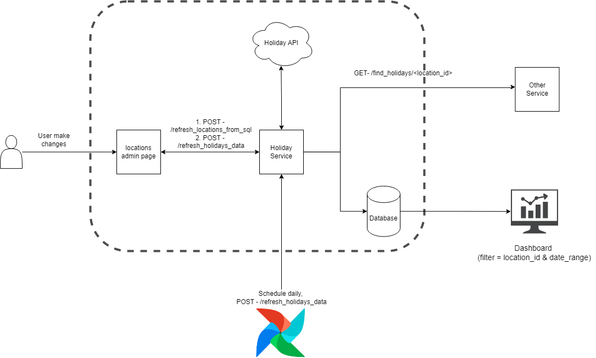

# Holiday API Flask Application

## Overview

This project is a Flask-based API that interacts with a PostgreSQL database and an external Holiday API to manage and retrieve holiday data. The application includes endpoints for refreshing location data, refreshing holiday data, and finding holidays based on location and date range. 

Daily 00.01 CRON Airflow job will fetch latest holidays data from Holidays API. This service provides capabilities for user to fetch latest holidays data or refresh locations data on demand.

### Conceptual Diagram:
<p align="center">
  
</p>
<p align="center">
  <em>Figure 1: Conceptual diagram</em>
</p>

## Prerequisites

Before you start, ensure you have the following installed:

- Python 3.x
- Docker Desktop or Docker Engine
- pip (Python package installer)
- Virtualenv (optional but recommended)


## Setup Instructions

1. **Clone the repository:**
    ```bash
    git clone https://github.com/your-username/holiday-api-flask-app.git
    cd holiday-api-flask-app
    ```

2. **Create a virtual environment:**
    ```bash
    python -m venv venv
    source venv/bin/activate   # On Windows: venv\Scripts\activate
    ```

3. **Install dependencies:**
    ```bash
    pip install -r requirements.txt
    ```

4. **Create a `.env` file:**
    ```env
    API_KEY=your_holiday_api_key
    DB_NAME=your_database_name
    DB_USERNAME=your_database_username
    DB_PASSWORD=your_database_password
    ```

5. **Init the PostgreSQL database using Dockerfile:**
   - Create a PostgreSQL database using dockerfile and ensure the credentials match those in the `.env` file.
   - Follow file named guide in infra folder to help about installation 

6. **Run the Flask application:**
    ```bash
    python main.py
    ```

## API Endpoints

### 1. Refresh Locations from SQL
   - **URL:** `/refresh_locations_from_sql`
   - **Method:** `POST`
   - **Description:** Updates the locations table from the `locations_data.sql` file. All existing data in the table will be overwritten.
   - **Response:** JSON with a success or error message.
   - **Example:** `curl "localhost:5000/refresh_locations_from_sql"`

### 2. Refresh Holidays Data
   - **URL:** `/refresh_holidays_data`
   - **Method:** `POST`
   - **Description:** Refreshes holiday data by fetching it from the Holiday API. All existing data in the table will be overwritten.
   - **Response:** JSON with a success or error message.
   - **Example:** `curl "localhost:5000/refresh_holidays_data"`

### 3. Find Holidays by Location and Date Range
   - **URL:** `/find_holidays/<location_id>`
   - **Method:** `GET`
   - **Description:** Retrieves holidays for a given location within a specified date range from database.
   - **Parameters:**
     - `start_date` (query parameter, required): The start date for the range.
     - `end_date` (query parameter, required): The end date for the range.
   - **Response:** JSON with a list of holidays or an error message.
   - **Example:** `curl "localhost:5000/find_holidays/fdbf55b4-1b97-43a8-a096-a71d0b9d6940?start_date=2024-01-01&end_date=2024-12-31"`

## Error Handling

The application includes global error handling using Flask's `@app.errorhandler` decorators. Common errors like `404 Not Found` and `500 Internal Server Error` are handled and return appropriate JSON responses.

## Closing the Database Connection

The database connection is automatically closed when the application context is torn down using the `@app.teardown_appcontext` decorator.

## License

This project is licensed under the MIT License. See the [LICENSE](LICENSE) file for details.

## Note:
For this task context, Airflow job mentioned in overview is not included in this repository. This documentation is structured as if it will be used in a real-world scenario.

